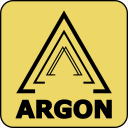

# Introduction
Argon is a plugin for Unity that lets you configure Unity game objects from within Blender.

Argon has two parts:

* a Blender addon that exports FBX files marked up with custom properties. [Hosted here.](https://github.com/Argon-ops/argon-ble)
* a Unity plugin that imports those files and applies those properties as Unity components. (This repository)

The import script sets up connections between components as needed.

# Minimum Requirements

* Blender 3.2.1
* Unity 2022.3.61f1

# Installation

## Unity

Put the files in this repo into the **Assets** folder of your Unity project. The easiest way to do this is to clone this repository into your Assets folder. Alternately, a version of Argon will be available on the Asset Store soon but it will mostly lag behind this repo.

## Blender
Two ways to install the Blender addon: from a zip file or from [source](https://github.com/Argon-ops/argon-ble).

## Option 1: Blender from the zip file
* Open Blender and open a **Preferences** view
* Go to **Add-ons**
* Click the ‘Install…’ button
* Find and install Argon_Plugin_Source.zip in this repo under Resources/Blender
* The Argon plugin activation box should come into view (possibly after several seconds)
* Click the check box to activate it, if it's not checked already.

## Option 2: Blender from the source files
* IMPORTANT: if you have previously installed from zip (Option 1), remove/uninstall that version of the addon from Preferences
* Clone the [addon repository](https://github.com/Argon-ops/argon-ble).
* In Blender open a **Scripting** view
* Click the folder icon to load the **boot2.py** script located in the top level of the repo.
* Run the script by clicking the '>' button near the top of the Scripting view.

Install from the source files to get the latest version of the addon or any previous version to meet your requirements. The boot2.py script makes it easy to reload the source (just re-run the script) which is useful if you want to make changes to the addon code and see them in Blender right away; (otherwise this requires uninstalling the addon in preferences, rezipping the source, etc.). 

Installing via the boot2.py script has the disadvantage that Argon will not install in Blender on load: you'll have to re-run the script any time you re-open a file.

## Verify that the Blender addon is installed
You should see a new tab on the right side of your 3D view in Blender that is titled **Argon** (Press ‘n’ while hovering your mouse in the 3D view if you don’t see any right side tabs.)

## Use Argon
See [demos and quickstarts on Argon's main page](https://argon.yebooyah.club/argon/)

[Documentation here](https://argon.yebooyah.club/docs/mediawiki-1.41.0/index.php?title=Main_Page)

